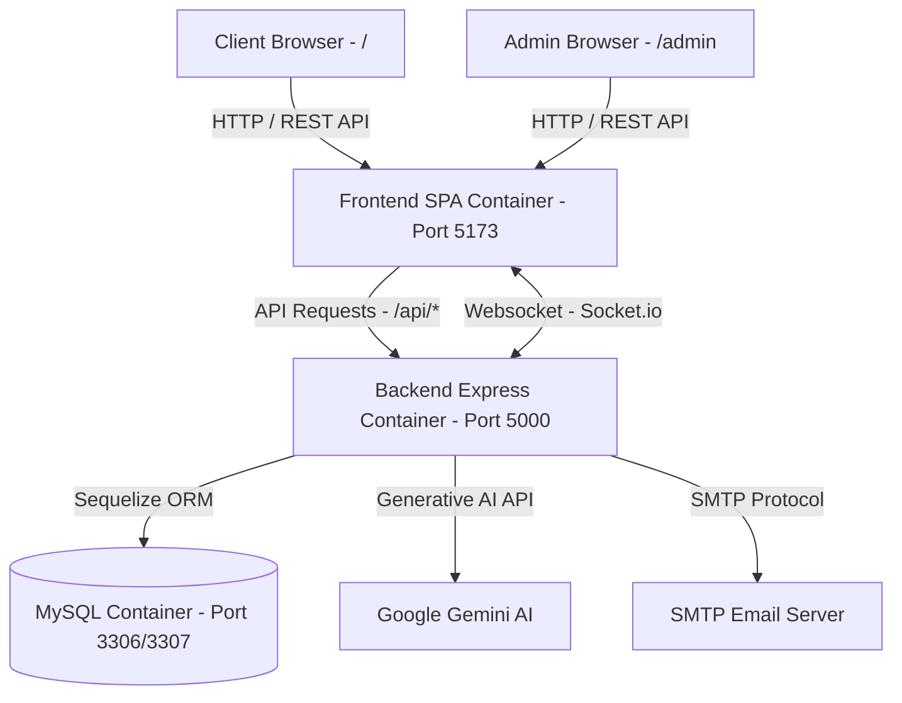

# 🏗️ Kiến Trúc Hệ Thống (System Architecture)

## 📌 Tổng Quan
Dự án **SPA Lan Anh Beauty** được thiết kế theo kiến trúc **Monorepo chuẩn hóa**, tách biệt rõ ràng giữa **Backend (RESTful API & Realtime Socket.io)** và **Frontend (Vite Single Page Application gộp Client + Admin)**. Toàn bộ hệ thống được đóng gói và vận hành thông qua **Docker & Docker Compose**.

---

## 🛠️ Công Nghệ Sử Dụng (Tech Stack)

### 1. Backend Service (`backend/`)
- **Runtime:** Node.js (v20 Alpine)
- **Framework:** Express.js
- **Database ORM:** Sequelize (MySQL 8.0)
- **Realtime Communication:** Socket.io (Tư vấn trực tiếp giữa Khách hàng và Staff/Admin)
- **Authentication:** JWT (JSON Web Tokens) với AccessToken + RefreshToken & Cookie/Header session
- **AI Integration:** Google Gemini AI API (Chatbot tư vấn tự động 24/7)
- **Email Service:** Nodemailer (Gửi mail thông báo đặt lịch thành công)

### 2. Frontend Service (`frontend/`)
- **Framework:** React 19 + Vite 8
- **Routing:** React Router v7 (Split layout: `MainLayout` cho Client ở `/` và `AdminLayout` cho Admin ở `/admin`)
- **Styling:** Vanilla CSS Modules + Tailwind CSS v4 + HSL Luxury Color Palette
- **State & Context:** React Context API (`AuthContext` quản lý người dùng, token và role)
- **Rich Text Editor:** TinyMCE React Editor (Quản lý bài viết và nội dung dịch vụ trong Admin)
- **Icons:** Combined Heroicons & Lucide Icons

### 3. Database & Containerization
- **Database:** MySQL 8.0 (với `mysql_data` Docker persistent volume)
- **Orchestration:** Docker Compose (WSL / Linux Containerization)

---

## 📐 Sơ Đồ Cấu Trúc Tổng Thể



---

## 📂 Tổ Chức Thư Mục Mã Nguồn

```
SPA-Lan-Anh-Beauty/
├── backend/
│   ├── src/
│   │   ├── config/         # Database & app configurations
│   │   ├── controllers/    # Route controllers
│   │   ├── database/       # Migrations & Seeders
│   │   ├── middlewares/    # Auth, Validation & Error middlewares
│   │   ├── models/         # Sequelize models (User, Service, Booking, Chat...)
│   │   ├── routes/         # Express API routes
│   │   ├── services/       # Business logic layer (Catalog, Booking, Chatbot...)
│   │   └── utils/          # Helpers & Email templates
│   ├── Dockerfile
│   └── .dockerignore
├── frontend/
│   ├── public/             # Static assets (Logo.png, icons.svg)
│   ├── src/
│   │   ├── assets/         # Images & static media
│   │   ├── components/     # Client, Admin & Shared components
│   │   ├── context/        # AuthContext & global states
│   │   ├── layouts/        # MainLayout (Client) & AdminLayout (Admin)
│   │   ├── pages/          # client/ pages & admin/ pages
│   │   ├── styles/         # Global styles & Tailwind entry
│   │   ├── App.jsx         # Unified React Router configuration
│   │   ├── icons.jsx       # Consolidated icon library
│   │   └── main.jsx        # App entrypoint
│   ├── Dockerfile
│   ├── vite.config.js
│   └── .dockerignore
├── docs/                   # Tài liệu kỹ thuật chi tiết
├── docker-compose.yml      # Docker compose configuration
├── .dockerignore           # Global Docker ignore rules
└── README.md               # Tài liệu tổng quan dự án
```
