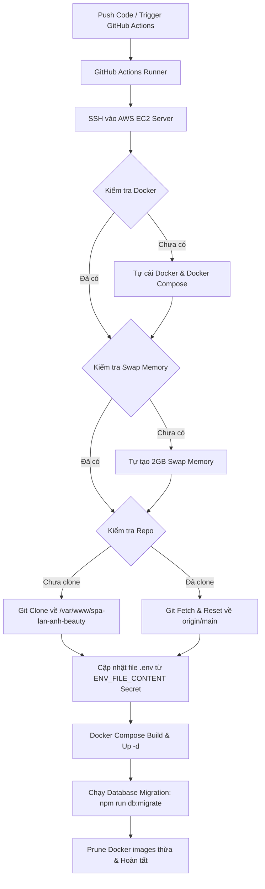

# 🚀 Hướng Dẫn Tự Động Deploy Dự Án SPA Lan Anh Beauty Lên AWS EC2 Qua GitHub Actions (CI/CD)

Tài liệu này hướng dẫn chi tiết về cơ chế **tự động hóa 100%** quá trình triển khai dự án lên máy chủ **AWS EC2 (Ubuntu 26.04 / 24.04 / 22.04 LTS)** bằng GitHub Actions và Docker Compose mà **không cần thao tác thủ công trên VPS**.

---

## 📌 1. Tổng Quan Quy Trình Triển Khai

Mỗi khi bạn thực hiện `git push` code lên nhánh `main` (hoặc kích hoạt thủ công trong tab Actions), GitHub Actions sẽ tự động SSH vào máy chủ AWS EC2 và thực thi toàn bộ các bước sau:



---

## 🔑 2. Danh Sách GitHub Secrets Đã Cấu Hình

Vào GitHub Repo ➔ **Settings** ➔ **Secrets and variables** ➔ **Actions**:

| Tên Secret | Ý nghĩa | Trạng thái |
| :--- | :--- | :--- |
| **`VPS_HOST`** | Public IPv4 Address của máy chủ AWS EC2 | ✅ Đã cấu hình |
| **`VPS_USERNAME`** | Username SSH (Mặc định: `ubuntu`) | ✅ Đã cấu hình |
| **`VPS_SSH_KEY`** | Nội dung file Private Key (`.pem`) | ✅ Đã cấu hình |
| **`VPS_PORT`** | Cổng SSH (Mặc định: `22`) | ✅ Đã cấu hình |
| **`ENV_FILE_CONTENT`** | Nội dung hoàn chỉnh của file `.env` Production | ✅ Đã cấu hình |

---

## 🛠️ 3. Cấu Hình File Workflow (`.github/workflows/deploy.yml`)

File cấu hình CI/CD tự động nằm tại vị trí:
`[deploy.yml](file:///.github/workflows/deploy.yml)`

Nó chứa đầy đủ logic tự phục hồi (Self-healing), tự cài đặt môi trường nếu máy chủ EC2 mới tinh chưa có gì.

---

## ⚡ 4. Cách Kích Hoạt Deploy

### Cách 1: Tự động (Khuyên dùng)
Chỉ cần thực hiện push code lên branch `main`:
```bash
git add .
git commit -m "feat: cap nhat tinh nang moi"
git push origin main
```

### Cách 2: Kích hoạt thủ công bằng tay
1. Truy cập vào GitHub Repository trên trình duyệt.
2. Chuyển sang tab **Actions**.
3. Chọn Workflow **CD - Deploy to Production AWS EC2 / VPS**.
4. Nhấn nút **Run workflow** ➔ Chọn branch `main` ➔ Bấm **Run workflow**.

---

## 🌐 5. Cấu Hình Tên Miền (Domain) & SSL HTTPS (Certbot)

Sau khi app đã deploy thành công và truy cập được qua IP của EC2, bạn trỏ domain về IP và cài SSL miễn phí:

1. **Trỏ bản ghi DNS (A-Record):**
   - Type: `A`
   - Name: `@` (hoặc `spa`)
   - Value: `<PUBLIC_IP_CUA_AWS_EC2>`

2. **Cài đặt SSL HTTPS miễn phí (Certbot):**
   SSH vào EC2 (`ssh vps-aws`) và chạy 1 lệnh duy nhất:
   ```bash
   sudo apt-get install -y certbot python3-certbot-nginx
   sudo certbot --nginx -d test.yourdomain.com
   ```

---

## 📊 6. Lệnh Kiểm Tra & Khắc Phục Sự Cố Trên AWS EC2

Khi cần kiểm tra trạng thái dịch vụ trên máy chủ:

```bash
# Di chuyển vào thư mục dự án trên EC2
cd /var/www/spa-lan-anh-beauty

# Xem trạng thái các container đang chạy
sudo docker compose -f docker-compose.prod.yml ps

# Xem log thực tế của Backend
sudo docker compose -f docker-compose.prod.yml logs -f backend

# Xem log của Nginx Reverse Proxy
sudo docker compose -f docker-compose.prod.yml logs -f nginx
```
