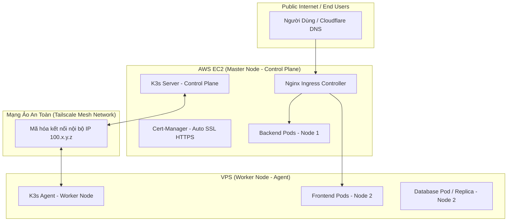
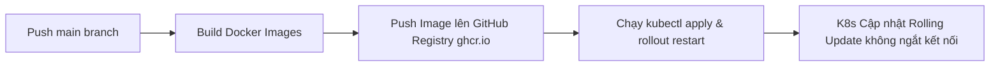

# ☸️ Hướng Dẫn Kiến Trúc & Triển Khai Kubernetes (K3s) Multi-Node (1 AWS EC2 + 1 VPS)

Tài liệu này hướng dẫn chi tiết quy trình xây dựng cụm **Kubernetes Multi-Node (Hybrid Multi-Cloud)** sử dụng bản phân phối **K3s** siêu nhẹ, kết nối **1 máy chủ AWS EC2** và **1 máy chủ VPS** thông qua mạng VPN riêng tư **Tailscale**.

---

## 📌 1. Tổng Quan Kiến Trúc Cụm K3s Cluster



### Tại sao chọn K3s?
- **Siêu Nhẹ (Lightweight)**: Tiêu tốn chưa tới **512MB RAM**, cực kỳ phù hợp cho máy chủ EC2 t2.micro / t3.small và VPS nhỏ.
- **Tiêu Chuẩn CNCF**: Tương thích 100% với Kubernetes chuẩn (`kubectl`, `helm`, `ingress-nginx`, `cert-manager`).
- **Tích Hợp Sẵn**: Đi kèm Traefik/Nginx Ingress, Local-path Storage, CoreDNS, Flannel CNI.

---

## 🔑 2. Chuẩn Bị Hạ Tầng & Mạng Nội Bộ (Tailscale VPN)

Vì 2 máy chủ nằm ở 2 nhà cung cấp hạ tầng khác nhau (AWS và VPS khác), cần kết nối chúng qua dải mạng nội bộ bảo mật trước khi join cụm K8s.

### Bước 2.1: Cài Đặt Tailscale Tạo Mạng LAN Mở Rộng
Thực hiện trên **CẢ 2 MÁY CHỦ** (AWS EC2 & VPS):

```bash
# Cài đặt Tailscale
curl -fsSL https://tailscale.com/install.sh | sh

# Khởi động kết nối (Đăng nhập theo liên kết hiển thị trên màn hình)
sudo tailscale up
```

Sau khi hoàn tất, chạy lệnh kiểm tra địa chỉ IP mạng nội bộ Tailscale (`100.x.y.z`):
```bash
tailscale ip -4
```

---

## 🚀 3. Các Bước Cài Đặt K3s Multi-Node Cluster

### Bước 3.1: Khởi Tạo K3s Server Trên Master Node (AWS EC2)

SSH vào **AWS EC2** và chạy lệnh:
```bash
# Cài đặt K3s Server chỉ định IP Tailscale làm Node IP
curl -sfL https://get.k3s.io | sh -s - \
  --node-ip=$(tailscale ip -4) \
  --flannel-backend=wireguard-native \
  --write-kubeconfig-mode 644
```

Lấy **Node Token** bí mật để các Worker kết nối vào:
```bash
sudo cat /var/lib/rancher/k3s/server/node-token
```
*(Lưu lại mã Token này cho bước tiếp theo)*

---

### Bước 3.2: Kết Nối Worker Node (VPS) Vào Master

SSH vào **VPS** và chạy lệnh:
```bash
# Thay <TAILSCALE_IP_EC2> và <K3S_TOKEN> bằng thông tin thực tế
export K3S_URL="https://<TAILSCALE_IP_EC2>:6443"
export K3S_TOKEN="<K3S_TOKEN_TU_BUOC_3_1>"

curl -sfL https://get.k3s.io | K3S_URL=$K3S_URL K3S_TOKEN=$K3S_TOKEN sh -s - \
  --node-ip=$(tailscale ip -4)
```

---

### Bước 3.3: Kiểm Tra Trạng Thái Cụm Cluster

SSH trở lại **AWS EC2 (Master Node)** và kiểm tra:
```bash
kubectl get nodes -o wide
```

**Kết quả thành công:**
```text
NAME         STATUS   ROLES                  AGE   VERSION        INTERNAL-IP
aws-ec2      Ready    control-plane,master   5m    v1.28.x+k3s1   100.xxx.xxx.1
vps-worker   Ready    <none>                 2m    v1.28.x+k3s1   100.xxx.xxx.2
```

---

## 📂 4. Cấu Trúc File Manifest Kubernetes (`k8s/`) Trong Dự Án

Cấu trúc thư mục định nghĩa Kubernetes cho dự án `SPA-Lan-Anh-Beauty`:

```text
SPA-Lan-Anh-Beauty/
├── k8s/
│   ├── namespace.yaml
│   ├── configmap.yaml
│   ├── secret.yaml
│   ├── backend-deployment.yaml
│   ├── backend-service.yaml
│   ├── frontend-deployment.yaml
│   ├── frontend-service.yaml
│   └── ingress.yaml
```

### Mẫu File Manifest Ví Dụ:

#### 1. `k8s/namespace.yaml`
```yaml
apiVersion: v1
kind: Namespace
metadata:
  name: spa-lan-anh
```

#### 2. `k8s/backend-deployment.yaml` (Zero-downtime Deployment)
```yaml
apiVersion: apps/v1
kind: Deployment
metadata:
  name: spa-backend
  namespace: spa-lan-anh
spec:
  replicas: 2
  strategy:
    type: RollingUpdate
    rollingUpdate:
      maxSurge: 1
      maxUnavailable: 0
  selector:
    matchLabels:
      app: spa-backend
  template:
    metadata:
      labels:
        app: spa-backend
    spec:
      containers:
        - name: backend
          image: ghcr.io/user6m14d05y/spa-backend:latest
          ports:
            - containerPort: 5000
          resources:
            requests:
              memory: "128Mi"
              cpu: "100m"
            limits:
              memory: "512Mi"
              cpu: "500m"
```

#### 3. `k8s/ingress.yaml` (Nginx Ingress + Auto SSL Cert-Manager)
```yaml
apiVersion: networking.k8s.io/v1
kind: Ingress
metadata:
  name: spa-ingress
  namespace: spa-lan-anh
  annotations:
    cert-manager.io/cluster-issuer: "letsencrypt-prod"
spec:
  ingressClassName: nginx
  rules:
    - host: spalananhbeauty.com
      http:
        paths:
          - path: /api
            pathType: Prefix
            backend:
              service:
                name: spa-backend-service
                port:
                  number: 5000
          - path: /
            pathType: Prefix
            backend:
              service:
                name: spa-frontend-service
                port:
                  number: 80
  tls:
    - hosts:
        - spalananhbeauty.com
      secretName: spa-lan-anh-tls
```

---

## 🔄 5. Quyết Định Triển Khai Tự Động (GitHub Actions CI/CD)

Khi sử dụng K8s, quy trình CI/CD sẽ thay đổi chuyên nghiệp hơn:



### Các Bước Cấu Hình GitHub Secrets:
1. SSH vào AWS EC2, lấy nội dung file Kubeconfig:
   ```bash
   cat /etc/rancher/k3s/k3s.yaml
   ```
   *(Thay địa chỉ `127.0.0.1` trong file thành IP Public của EC2)*
2. Lưu toàn bộ nội dung file vào GitHub Secret đặt tên là **`KUBE_CONFIG_DATA`**.

### Mẫu GitHub Action Deploy `.github/workflows/deploy-k8s.yml`:
```yaml
name: CD - Deploy to K3s Cluster

on:
  push:
    branches: [ "main" ]

jobs:
  build-and-deploy:
    runs-on: ubuntu-latest
    steps:
      - name: Checkout Code
        uses: actions/checkout@v4

      - name: Log in to GitHub Container Registry
        uses: docker/login-action@v3
        with:
          registry: ghcr.io
          username: ${{ github.actor }}
          password: ${{ secrets.GITHUB_TOKEN }}

      - name: Build & Push Backend Image
        uses: docker/build-push-action@v5
        with:
          context: ./backend
          file: ./backend/Dockerfile.prod
          push: true
          tags: ghcr.io/${{ github.repository_owner }}/spa-backend:${{ github.sha }},ghcr.io/${{ github.repository_owner }}/spa-backend:latest

      - name: Set Kubernetes Context
        uses: azure/k8s-set-context@v3
        with:
          method: kubeconfig
          kubeconfig: ${{ secrets.KUBE_CONFIG_DATA }}

      - name: Deploy to K3s Cluster
        run: |
          kubectl apply -f k8s/
          kubectl rollout restart deployment/spa-backend -n spa-lan-anh
```

---

## 📊 6. So Sánh Docker Compose vs Kubernetes (K3s)

| Tiêu chí | Docker Compose (Hiện tại) | Kubernetes K3s (Tài liệu này) |
| :--- | :--- | :--- |
| **Số lượng máy chủ** | Single-Node (Chỉ 1 máy EC2) | Multi-Node (Tận dụng cả EC2 + VPS) |
| **Downtime khi Deploy** | Gián đoạn nhẹ vài giây khi rebuild | **0% Downtime** (Rolling Update) |
| **Tự Phục Hồi (Self-Healing)** | Khởi động lại container nếu rớt | Tự phát hiện Pod treo/chết & cấp mới |
| **Tự Động Mở Rộng (Auto-scaling)**| Không hỗ trợ tự động | Hỗ trợ HPA (Horizontal Pod Autoscaler) |
| **Cân Bằng Tải (Load Balancing)**| Nginx Reverse Proxy tĩnh | Ingress Controller động thông minh |
