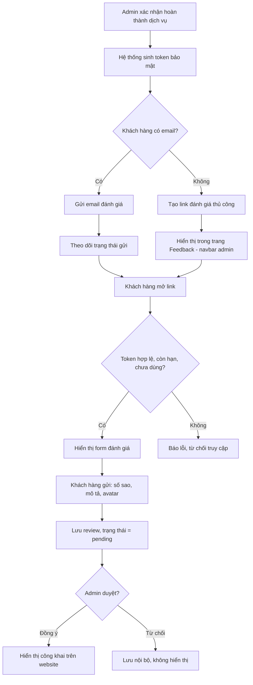

# Nghiệp vụ hệ thống đánh giá khách hàng sau dịch vụ spa

> Tài liệu tổng hợp luồng nghiệp vụ, bảo mật, cấu trúc dữ liệu và đề xuất công nghệ cho module tự động gửi yêu cầu đánh giá khách hàng sau khi hoàn thành dịch vụ.

## 1. Mục tiêu

- Tự động gửi yêu cầu đánh giá cho khách hàng ngay sau khi admin xác nhận dịch vụ đã hoàn thành.
- Đảm bảo chỉ đúng khách hàng đã sử dụng dịch vụ mới có thể gửi đánh giá cho booking đó (chống giả mạo, chống spam).
- Xử lý được trường hợp khách hàng không có email trong hồ sơ.
- Kiểm duyệt nội dung trước khi hiển thị công khai trên website.

## 2. Sơ đồ luồng tổng quan



## 3. Chi tiết từng bước

### 3.1 Admin xác nhận hoàn thành
- Chuyển trạng thái booking sang `completed`. Thao tác này phải **idempotent** — bấm nhiều lần không được sinh nhiều token/email.
- Ghi log: ai xác nhận, lúc nào (audit trail).

### 3.2 Sinh token bảo mật
- Token ngẫu nhiên đủ dài (UUID v4 hoặc random 32 byte), **không dùng ID tuần tự** của booking.
- Gắn với `booking_id` + `customer_id` + `service_id`.
- Có hạn sử dụng (đề xuất 7–14 ngày) và **dùng một lần** — sau khi nộp đánh giá, đánh dấu `used_at` để vô hiệu hoá.
- Chỉ lưu **hash** của token trong DB (không lưu plaintext), so khớp bằng hash khi xác thực.

### 3.3 Nhánh có email
- Gửi email qua dịch vụ transactional email (SendGrid/SES/Resend), có webhook trả về trạng thái gửi thực tế.
- Đưa vào hàng đợi (queue) thay vì gửi đồng bộ, để hỗ trợ retry tự động khi thất bại.

### 3.4 Nhánh không có email
- Token vẫn được sinh đầy đủ như luồng có email — **không giảm bảo mật chỉ vì thiếu email**.
- Link được đưa vào trang **Feedback** mới trong navbar khu vực quản trị, để nhân viên:
  - Copy link gửi tay qua Zalo/SMS/Messenger.
  - Xuất QR code để khách quét trực tiếp tại quầy.
- Trang này chứa link nhạy cảm (ai cầm link đều review được thay khách) → giới hạn quyền xem theo role, log lại nhân viên nào đã copy/gửi link nào.

### 3.5 Khách hàng mở link & xác thực token
- Kiểm tra: token tồn tại, còn hạn, chưa dùng. Sai điều kiện nào cũng trả thông báo chung chung (không tiết lộ lý do cụ thể).
- Rate limit trên endpoint xác thực để chống brute-force đoán token.
- (Tuỳ chọn, khuyến nghị cho link gửi thủ công) Thêm bước xác thực phụ nhẹ: yêu cầu nhập số điện thoại hoặc mã đặt lịch trùng khớp trước khi hiển thị form, đề phòng link bị lộ ra ngoài phạm vi dự định.

### 3.6 Form đánh giá
- **Tên dịch vụ**: tự động lấy từ booking, khách không được tự nhập.
- **Số sao**: bắt buộc, số nguyên 1–5.
- **Mô tả**: không bắt buộc, giới hạn ký tự (xem mục 7), sanitize để chống XSS trước khi lưu.
- **Avatar**: mặc định dạng chữ cái đầu + màu nền (không bắt buộc upload ảnh thật).
- **Tên hiển thị**: dùng tên rút gọn từ hồ sơ khách hàng (ví dụ "Minh Anh"), không cho tự gõ tuỳ ý.
- Có CAPTCHA (Cloudflare Turnstile / hCaptcha) để chống bot.

### 3.7 Lưu & kiểm duyệt
- Review mới có `status = pending`, chưa hiển thị công khai ngay.
- Chặn trùng lặp: một `booking_id` chỉ được review một lần.
- Admin duyệt (`approved`) hoặc từ chối (`rejected`, lưu lý do nội bộ).
- Trang public chỉ query các review có `status = approved`.

## 4. Trạng thái gửi thông báo (`send_status`)

| Giá trị | Ý nghĩa |
|---|---|
| `pending` | Đang trong hàng đợi, chưa gửi |
| `sent` | Server email đã nhận và gửi đi |
| `delivered` | Đã xác nhận tới hộp thư (qua webhook của provider) |
| `failed` | Gửi thất bại (bounce, sai địa chỉ, lỗi SMTP...) |
| `no_contact` | Không có email từ đầu → chuyển sang link thủ công |
| `manual_sent` | Nhân viên đã gửi tay qua link/QR, tự đánh dấu |

Gửi thất bại nên tự động **retry** (ví dụ 3 lần, giãn cách 15–30 phút); hết số lần retry vẫn thất bại thì chuyển hiển thị trong trang Feedback để xử lý thủ công, tương tự trường hợp `no_contact`.

## 5. Bảo mật — checklist

- [ ] Token ngẫu nhiên, một lần, có hạn dùng — không dùng ID tuần tự trong URL.
- [ ] Chỉ lưu hash của token trong DB.
- [ ] HTTPS bắt buộc cho toàn bộ link đánh giá.
- [ ] Rate limit + CAPTCHA trên endpoint xác thực token và submit review.
- [ ] Sanitize input, giới hạn ký tự cứng ở backend (không chỉ ở frontend).
- [ ] Kiểm duyệt nội dung trước khi publish.
- [ ] Phân quyền truy cập trang Feedback (navbar) — chỉ nhân viên được phép mới thấy link/QR.
- [ ] Log lại thao tác gửi tay (ai, lúc nào, link nào).
- [ ] Không để lộ thông tin nhạy cảm của khách (email, SĐT) trong nội dung email hoặc review hiển thị công khai.
- [ ] Có cơ chế cho khách yêu cầu gỡ/sửa đánh giá của mình sau này (phù hợp Nghị định 13/2023/NĐ-CP về bảo vệ dữ liệu cá nhân).

## 6. Cấu trúc dữ liệu đề xuất (MySQL)

```sql
CREATE TABLE review_tokens (
  id             BIGINT UNSIGNED AUTO_INCREMENT PRIMARY KEY,
  booking_id     BIGINT UNSIGNED NOT NULL,
  customer_id    BIGINT UNSIGNED NOT NULL,
  token_hash     CHAR(64) NOT NULL,                  -- SHA-256 của token, không lưu plaintext
  expires_at     DATETIME NOT NULL,
  used_at        DATETIME NULL,
  send_status    ENUM('pending','sent','delivered','failed','no_contact','manual_sent')
                 NOT NULL DEFAULT 'pending',
  send_attempts  TINYINT UNSIGNED NOT NULL DEFAULT 0,
  failed_reason  VARCHAR(255) NULL,
  created_at     DATETIME NOT NULL DEFAULT CURRENT_TIMESTAMP,
  UNIQUE KEY uq_token_hash (token_hash),
  KEY idx_booking (booking_id),
  KEY idx_send_status (send_status)
) ENGINE=InnoDB DEFAULT CHARSET=utf8mb4;

CREATE TABLE reviews (
  id               BIGINT UNSIGNED AUTO_INCREMENT PRIMARY KEY,
  booking_id       BIGINT UNSIGNED NOT NULL UNIQUE,   -- 1 booking chỉ review 1 lần
  customer_id      BIGINT UNSIGNED NOT NULL,
  service_id       BIGINT UNSIGNED NOT NULL,
  rating           TINYINT UNSIGNED NOT NULL,         -- 1..5, kiểm tra ở tầng ứng dụng
  comment          VARCHAR(300) NULL,
  display_name     VARCHAR(100) NOT NULL,
  avatar_type      ENUM('initials','upload') NOT NULL DEFAULT 'initials',
  avatar_value     VARCHAR(255) NULL,
  status           ENUM('pending','approved','rejected') NOT NULL DEFAULT 'pending',
  rejection_reason VARCHAR(255) NULL,
  approved_by      BIGINT UNSIGNED NULL,
  approved_at      DATETIME NULL,
  created_at       DATETIME NOT NULL DEFAULT CURRENT_TIMESTAMP,
  KEY idx_status (status),
  KEY idx_service (service_id)
) ENGINE=InnoDB DEFAULT CHARSET=utf8mb4;

-- Tuỳ chọn: nhật ký gửi tay từ trang Feedback (navbar)
CREATE TABLE review_delivery_log (
  id              BIGINT UNSIGNED AUTO_INCREMENT PRIMARY KEY,
  review_token_id BIGINT UNSIGNED NOT NULL,
  staff_id        BIGINT UNSIGNED NOT NULL,
  action          ENUM('copied_link','generated_qr','marked_sent') NOT NULL,
  created_at      DATETIME NOT NULL DEFAULT CURRENT_TIMESTAMP,
  KEY idx_token (review_token_id)
) ENGINE=InnoDB DEFAULT CHARSET=utf8mb4;
```

## 7. Giới hạn nội dung & avatar

| Trường | Giới hạn / quy tắc |
|---|---|
| Số sao | Bắt buộc, số nguyên 1–5 |
| Mô tả | Không bắt buộc, tối đa 300 ký tự, sanitize HTML trước khi lưu |
| Tên dịch vụ | Tự động lấy từ booking, không cho nhập tay |
| Tên hiển thị | Lấy từ hồ sơ khách, rút gọn (tên + chữ cái đầu họ) |
| Avatar | Mặc định chữ cái đầu + màu nền; nếu cho upload thật thì giới hạn dung lượng, kiểm tra magic bytes, resize và strip EXIF |

## 8. Đề xuất công nghệ

**Backend (Node.js)**
- Framework: Fastify hoặc NestJS
- TypeScript, Prisma (hoặc Sequelize/TypeORM) cho MySQL
- Zod để validate input tại API layer
- Helmet.js + rate-limit cho các endpoint public
- BullMQ + Redis: hàng đợi gửi email, retry tự động
- Redis cache: danh sách review đã duyệt (giảm query MySQL lặp lại cho trang testimonials)
- sanitize-html (hoặc DOMPurify qua jsdom) cho phần mô tả
- Pino cho logging, Sentry cho theo dõi lỗi runtime

**Frontend (Vue)**
- Nuxt 3 (SSR/SSG) để SEO tốt hơn cho trang dịch vụ/testimonials
- Pinia cho state management
- VeeValidate + Zod cho validate form phía client
- Cloudflare Turnstile / hCaptcha cho form đánh giá công khai
- `@nuxt/image` để lazy-load và tối ưu ảnh

**Hạ tầng**
- MySQL: index cho `booking_id`, `token_hash`, `send_status`, `status`
- Redis: vừa làm broker cho BullMQ, vừa làm cache
- CDN cho static assets và ảnh
- CI/CD: GitHub Actions

## 9. Việc cần làm tiếp theo (đề xuất)

- [ ] Thiết kế template email đánh giá (nội dung, thương hiệu, link CTA).
- [ ] Dựng worker BullMQ xử lý gửi email + retry + cập nhật `send_status`.
- [ ] Xây trang Feedback trong navbar admin (danh sách booking cần gửi tay, nút copy link / xuất QR / đánh dấu đã gửi).
- [ ] Xây form đánh giá công khai (xác thực token, rating, mô tả, avatar mặc định).
- [ ] Xây trang kiểm duyệt cho admin (approve/reject).
- [ ] Viết test cho luồng: token hết hạn, token đã dùng, submit trùng booking, gửi email thất bại + retry.
- [ ] Cấu hình webhook từ nhà cung cấp email (SendGrid/SES) để cập nhật `delivered`/`failed` chính xác.
