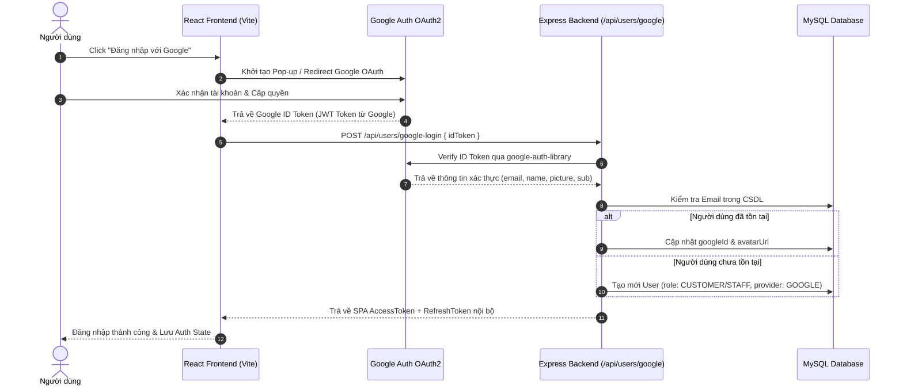

# 🔑 Đánh Giá & Hướng Dẫn Triển Khai SSO (Single Sign-On Review)

Tài liệu này đánh giá hiện trạng đăng nhập Single Sign-On (SSO / OAuth2) trong hệ thống **SPA Lan Anh Beauty** và đưa ra phương án triển khai chuẩn bảo mật cho môi trường sản xuất.

---

## 🧐 1. Đánh Giá Hiện Trạng Hệ Thống (Current State Review)

### Giao diện Frontend (`frontend/src/pages/admin/Login/index.jsx`)
- Hiện tại trang Đăng nhập đã có thiết kế **Nút đăng nhập với Google** và **Đăng nhập với Facebook**.
- Khi người dùng bấm vào các nút này, giao diện hiển thị thông báo giả lập:
  `alert('🔧 Cần cấu hình Google App ID để kích hoạt')`

### Phía Backend (`backend/`)
- Cơ sở dữ liệu và API đăng nhập hiện tại (`/api/users/login`) thuần túy xác thực qua **Email / Phone + Password (Bcrypt)**.
- Bảng `Users` chưa có các trường dữ liệu dành cho SSO (`authProvider`, `googleId`, `facebookId`).
- Chưa tích hợp thư viện OAuth2 client hoặc Passport.js trên server.

---

## 🎯 2. Kiến Trúc Luồng Đăng Nhập SSO Đề Xuất (Recommended Architecture)

Đối với ứng dụng React Single Page Application (SPA) kết hợp Express REST API, phương án tối ưu nhất là sử dụng **Google Identity Services (GIS) / OAuth 2.0 Authorization Code Grant với PKCE** hoặc **ID Token Verification**.

### 🔄 Luồng Đăng Nhập SSO với Google (ID Token Flow)



---

## 🛠️ 3. Các Bước Triển Khai Kỹ Thuật (Implementation Roadmap)

### Step 1: Cập Nhật Database Schema (`backend/src/models/User.js`)
Bổ sung các trường vào Sequelize model `User`:
```javascript
authProvider: {
  type: DataTypes.ENUM('LOCAL', 'GOOGLE', 'FACEBOOK'),
  defaultValue: 'LOCAL',
},
googleId: {
  type: DataTypes.STRING,
  allowNull: true,
  unique: true,
},
facebookId: {
  type: DataTypes.STRING,
  allowNull: true,
  unique: true,
}
```

### Step 2: Cài Đặt Thư Viện Backend
```bash
npm install google-auth-library
```

### Step 3: Tạo Endpoint Xác Thực Token Backend (`backend/src/controllers/userController.js`)
```javascript
const { OAuth2Client } = require('google-auth-library');
const googleClient = new OAuth2Client(process.env.GOOGLE_CLIENT_ID);

exports.googleLogin = async (req, res) => {
  const { idToken } = req.body;
  
  // 1. Verify Google ID Token
  const ticket = await googleClient.verifyIdToken({
    idToken,
    audience: process.env.GOOGLE_CLIENT_ID,
  });
  const payload = ticket.getPayload(); // { email, name, picture, sub }

  // 2. Tim hoac Tao User trong DB
  let user = await User.findOne({ where: { email: payload.email } });
  if (!user) {
    user = await User.create({
      fullName: payload.name,
      email: payload.email,
      avatarUrl: payload.picture,
      googleId: payload.sub,
      authProvider: 'GOOGLE',
      role: 'STAFF', // Hoac CUSTOMER tuỳ quy tắc
    });
  }

  // 3. Phat hanh Token noii bo cua He Thong
  const accessToken = generateAccessToken(user);
  const refreshToken = generateRefreshToken(user);

  return res.json({ success: true, data: { user, accessToken, refreshToken } });
};
```

### Step 4: Cấu Hình Google Console Credentials
1. Truy cập [Google Cloud Console](https://console.cloud.google.com/).
2. Tạo Project mới -> OAuth Consent Screen.
3. Tạo OAuth 2.0 Client ID (Application Type: Web Application).
4. Thêm Authorized JavaScript Origins: `http://localhost:5173`, `https://yourdomain.com`.
5. Lưu `VITE_GOOGLE_CLIENT_ID` vào `.env`.

---

## 🔒 4. Khuyến Nghị Bảo Mật (Security Recommendations)

1. **Token Validation:** Không bao giờ tin tưởng thông tin người dùng gửi lên từ Frontend mà không xác thực `idToken` trực tiếp với API của Google.
2. **Account Linking Safety:** Nếu tài khoản email đã tồn tại với đăng nhập mật khẩu (`LOCAL`), khi người dùng bấm SSO Google với cùng email đó, cần hỏi người dùng hoặc yêu cầu xác nhận để tránh chiếm đoạt tài khoản.
3. **Cookie SameSite & HTTPS:** Trên VPS Production, bắt buộc bật SSL (HTTPS) và cấu hình `SameSite=Lax` / `Secure` cho cookie RefreshToken.
