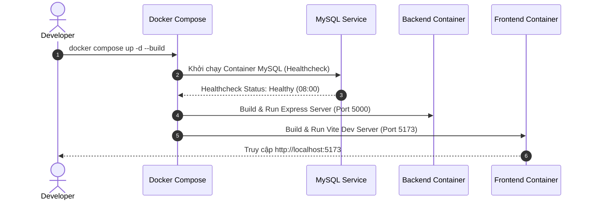
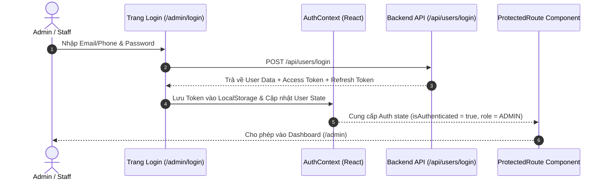
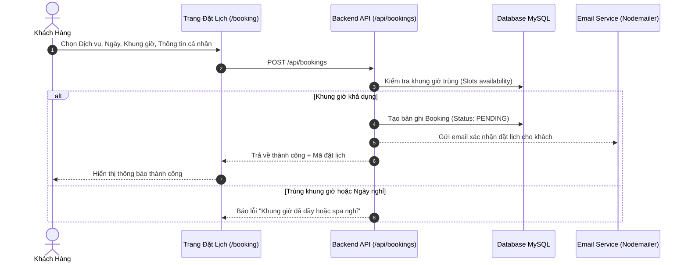
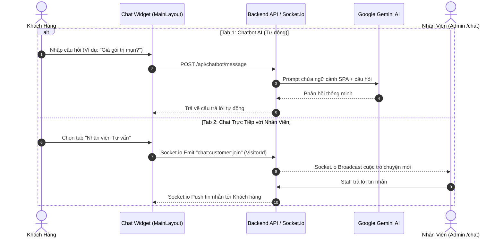

# 🔄 Quy Trình Hoạt Động Hệ Thống (System Workflows)

Tài liệu này giải thích chi tiết các workflow chính trong hệ thống **SPA Lan Anh Beauty**.

---

## 1. Quy Trình Phát Triển & Khởi Chạy (Development Workflow)

- **Môi trường phát triển:** Docker Compose quản lý 3 containers (`mysql`, `backend`, `frontend`).
- **Hot-reloading:** Source code được bind mount (`./frontend:/app` và `./backend:/app`), cho phép tự động reload khi chỉnh sửa file mà không cần rebuild container.
- **Dữ liệu MySQL:** Lưu trữ bền vững tại Docker Named Volume `mysql_data`.

---

## 2. Quy Trình Xác Thực & Phân Quyền (Auth & RBAC Workflow)

- **Các Vai Trò (Roles):**
  - `ADMIN`: Toàn quyền quản trị hệ thống (Tài khoản, Nhân viên, Dịch vụ, Lịch hẹn, Cấu hình).
  - `STAFF`: Quản lý Lịch hẹn, Khách hàng, Chat tư vấn và xem danh sách Dịch vụ.
  - `CUSTOMER`: Người dùng công khai trên website.
- **Bảo Vệ Route:** Component `<ProtectedRoute roles={['ADMIN', 'STAFF']}>` chặn các truy cập trái phép và tự động chuyển hướng về `/admin/login`.

---

## 3. Quy Trình Đặt Lịch Hẹn (Booking Workflow)

---

## 4. Quy Trình Chat Tư Vấn: AI Chatbot & Live Chat (Chat Workflow)

---

## 5. Quy Trình Quản Lý Danh Mục & Dịch Vụ (Catalog Workflow)

- **Danh mục Dịch vụ (Categories):** Cấu trúc cây (Tree Hierarchy) hỗ trợ danh mục cha - con.
- **Dịch vụ Nổi Bật (`isFeatured`):** Các dịch vụ được đánh dấu `isFeatured = true` trong Admin sẽ tự động xuất hiện trên **Hero Banner** ở trang chủ Client.
